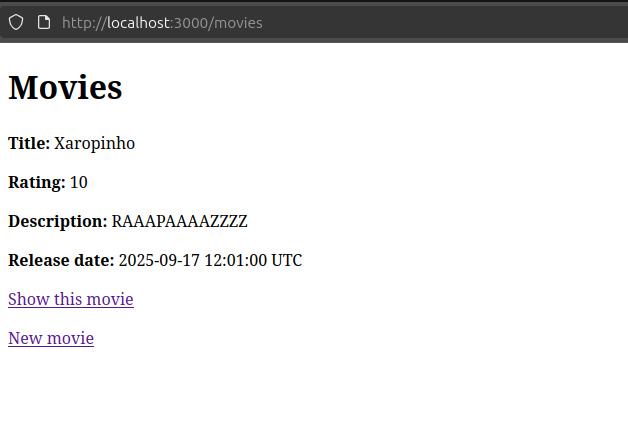

# RottenPotatoes

Aluno: João Magno Lourenço Soares

Matrícula: 232038077



Aplicação web para um banco de dados de filmes, desenvolvido em Ruby on Rails. A implementação foi guiada pelo cap 4 do saasbook.

## Como foi implementado (seguindo instruções do livro)

A construção do projeto seguiu as "lições" que apresentadas no material:

* **Arquitetura Model-View-Controller (MVC):** A aplicação foi estruturada sobre o padrão MVC, onde Models gerenciam os dados, Views cuidam da apresentação e Controllers intermediam a comunicação.

* **Padrão Active Record:** O modelo `Movie` herda de `ActiveRecord::Base`, utilizando o padrão do Active Record para realizar as operações de CRUD (Create, Read, Update, Delete) no banco de dados.

* **Convenção sobre Configuração:** O princípio de "Convention over Configuration" do Rails foi adotado para mapear automaticamente a classe do modelo (`Movie`) para a tabela do banco de dados (`movies`) e associar controladores e visões, minimizando a necessidade de código explícito de configuração.

* **Migrations para o Schema do Banco de Dados:** A estrutura da tabela `movies` foi definida e versionada utilizando uma migração do Rails, garantindo que o schema seja consistente entre diferentes ambientes. Isso é importante pra que o trabalho consiga ser verificado/corrigido por pessoas com versões diferentes do ruby ou do rails.

* **Roteamento RESTful:** As rotas foram geradas usando o helper `resources :movies`, que cria um conjunto completo de rotas RESTful padronizadas, mapeando URLs e verbos HTTP para ações específicas do controlador.

* **Fluxo Controller-View:** Os controladores utilizam variáveis de instância (por exemplo `@movie`) para passar dados para as views. Após ações que modificam dados (como criar ou deletar), o usuário é redirecionado (`redirect_to`) com uma mensagem de "feedback" através do `flash`.

# RottenPotatoes

Este projeto é uma aplicação web para um banco de dados de filmes, desenvolvido em Ruby on Rails. A implementação foi guiada estritamente pelos conceitos e exemplos de um livro-base de Engenharia de Software.

## Principais Diretivas Seguidas do Livro-Guia

A construção do projeto seguiu as seguintes diretivas fundamentais apresentadas no material:

* [cite_start]**Arquitetura Model-View-Controller (MVC):** A aplicação foi estruturada sobre o padrão MVC, onde Models gerenciam os dados, Views cuidam da apresentação e Controllers intermediam a comunicação. [cite: 6, 7]

* [cite_start]**Padrão Active Record:** O modelo `Movie` herda de `ActiveRecord::Base`, utilizando o padrão Active Record para realizar as operações de CRUD (Create, Read, Update, Delete) no banco de dados. [cite: 121, 129]

* [cite_start]**Convenção sobre Configuração:** O princípio de "Convention over Configuration" do Rails foi adotado para mapear automaticamente a classe do modelo (`Movie`) para a tabela do banco de dados (`movies`) e associar controladores e visões, minimizando a necessidade de código explícito de configuração. [cite: 85, 91, 145]

* [cite_start]**Migrations para o Schema do Banco de Dados:** A estrutura da tabela `movies` foi definida e versionada utilizando uma migração do Rails, garantindo que o schema seja consistente entre diferentes ambientes. [cite: 153, 227]

* [cite_start]**Roteamento RESTful:** As rotas foram geradas usando o helper `resources :movies`, que cria um conjunto completo de rotas RESTful padronizadas, mapeando URLs e verbos HTTP para ações específicas do controlador. [cite: 253]

* [cite_start]**Fluxo Controller-View:** Os controladores utilizam variáveis de instância (ex: `@movie`) para passar dados para as visões. [cite: 303, 310] [cite_start]Após ações que modificam dados (como criar ou deletar), o usuário é redirecionado (`redirect_to`) com uma mensagem de feedback através do `flash`. [cite: 335, 562]

## Como Instalar e Executar

Siga os passos abaixo para executar a aplicação em seu ambiente de desenvolvimento local.

### Pré-requisitos
Você precisa ter o seguinte instalado:
* Ruby
* Bundler
* Git

### Passos

1.  **Clone o repositório para sua máquina local:**

2.  **Instale as dependências do projeto:**
    ```sh
    bundle install
    ```

3.  **Crie e configure o banco de dados:**
    ```sh
    rails db:create
    rails db:migrate
    ```

4.  **Inicie o servidor Rails:**
    ```sh
    rails server
    ```

5.  **Acesse a aplicação:**
    Abra seu navegador e visite `http://localhost:3000/movies`.
